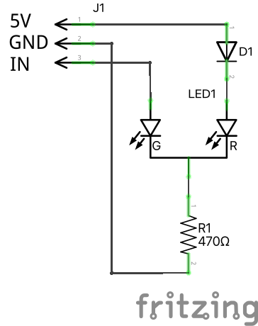
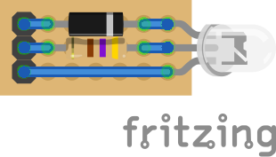

# BobbisDualColorLed

Diagrammet er som følger:

Hvis IN er 0V vil strømmen løbe fra 5V igennem D1, LED1-R (den røde LED) og modstanden R1 til GND. Herved vil LED1-R lyse. Hvis IN derimod er 5V vil strømmen løbe igennem LED1-G (den grønne LED) og modstanden R1 TIL GND. LED1-R vil, i dette tilfælde, ikke lyse idet spændingsfaldet over D1 og LED1-R ikke bliver stort nok grundet spændingsfaldet over LED1-G.

Det kan implementeres på et 7x3 hulprint således:

